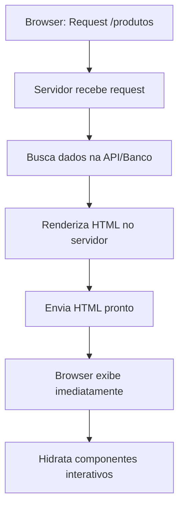
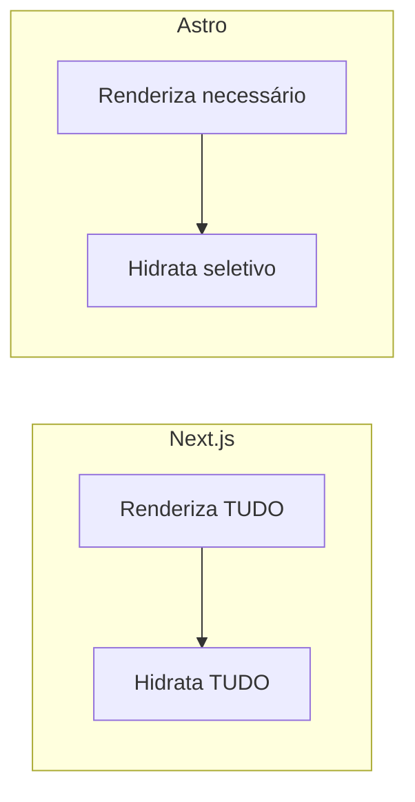

# Server-Side Rendering (SSR)

## O que é SSR

SSR é quando o servidor renderiza o HTML completo antes de enviar para o navegador. O usuário recebe uma página já processada, com conteúdo visível imediatamente.

**Vantagens**: SEO melhor que CSR (crawlers veem HTML completo), carregamento inicial mais rápido, dados sempre atualizados.

### Como funciona



---

## Next.js SSR

1. **Request**: Browser solicita página `/produtos`

2. **Fetch de dados**: Servidor busca informações necessárias

   ```javascript
   const produtos = await fetch("http://api.loja.com/produtos");
   ```

3. **Renderização server-side**: React roda no servidor

   ```javascript
   const html = ReactDOMServer.renderToString(
     <ProdutosList produtos={produtos} />
   );
   ```

4. **HTML gerado**: Servidor monta página completa

   ```html
   <!DOCTYPE html>
   <html>
     <body>
       <h1>Produtos</h1>
       <ul>
         <li>iPhone</li>
         <li>Samsung</li>
       </ul>
     </body>
   </html>
   ```

5. **Resposta**: Browser recebe HTML pronto para exibição

6. **Hidratação**: React conecta event listeners no client-side

---

## Astro SSR

1. **Request**: Browser solicita página `/blog`

2. **Processamento**: Servidor processa arquivo `.astro`

   ```javascript
   const posts = await fetch("http://cms.blog.com/posts");
   ```

3. **Renderização seletiva**: Apenas HTML/CSS necessário

   ```astro
   // Gera HTML estático, JavaScript opcional
   ```

4. **HTML otimizado**: Output mínimo e eficiente

   ```html
   <!DOCTYPE html>
   <html>
     <body>
       <h1>Blog</h1>
       <article>Post 1</article>
     </body>
   </html>
   ```

5. **Resposta**: Browser recebe HTML otimizado

6. **Hidratação seletiva**: JS carregado apenas para componentes marcados (`client:load`)

---

## Diferença Principal



### Estratégias diferentes

- **Next.js**: Renderização completa no servidor + hidratação total no client
- **Astro**: Renderização otimizada + hidratação apenas onde necessário

### Performance

- **Next.js**: Bundle maior, mais JavaScript, hidratação completa
- **Astro**: Bundle menor, JavaScript mínimo, hidratação seletiva

## Casos de Uso para SSR

### Quando usar SSR

- **E-commerce**: Páginas de produto precisam de SEO para aparecer no Google
- **Blogs/CMS**: Artigos devem ser indexados pelos motores de busca
- **Landing pages**: Marketing precisa de carregamento rápido e SEO
- **Portais de notícias**: Conteúdo atualizado constantemente
- **Apps com autenticação**: Dados personalizados por usuário
- **Sites corporativos**: SEO crítico para aquisição de clientes

### Quando NÃO usar SSR

- **Dashboards internos**: SEO irrelevante, dados sensíveis
- **Apps admin**: Usuários logados, performance menos crítica
- **Ferramentas internas**: Funcionalidade > SEO
- **Protótipos**: Velocidade de desenvolvimento prioritária

### Framework por caso de uso

| Caso de Uso     | Next.js  | Astro        | Justificativa                                          |
| --------------- | -------- | ------------ | ------------------------------------------------------ |
| E-commerce      | ✅ Ideal | ⚡ Excelente | Next.js: ISR para catálogo / Astro: Performance máxima |
| Blog            | ✅ Bom   | ⚡ Ideal     | Astro otimizado para conteúdo estático                 |
| Landing page    | ✅ Bom   | ⚡ Ideal     | Astro: Lighthouse scores naturalmente altos            |
| App complexa    | ✅ Ideal | ❌ Limitado  | Next.js: Melhor para interatividade pesada             |
| Portal notícias | ✅ Ideal | ⚡ Bom       | Next.js: ISR para atualizações automáticas             |
