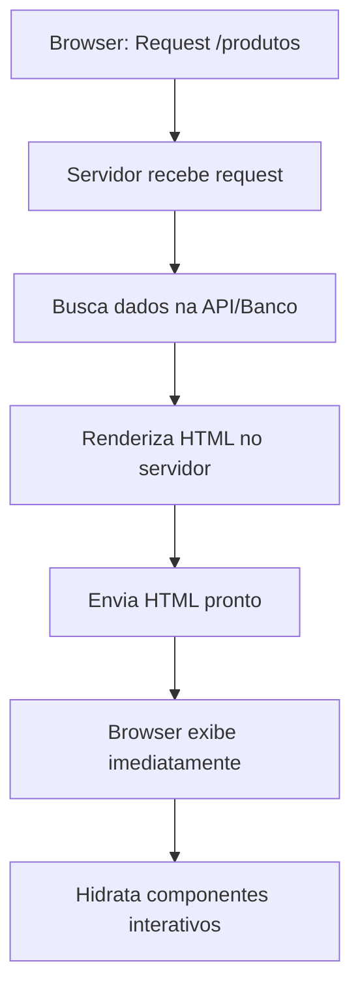
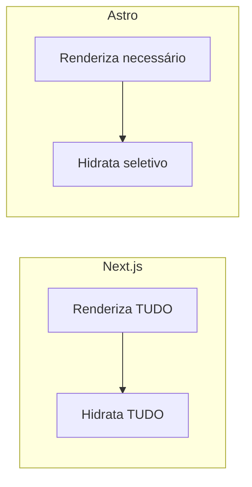

# Server-Side Rendering (SSR)

## O que é SSR

SSR é quando o servidor renderiza o HTML completo antes de enviar para o navegador. O usuário recebe uma página já processada, com conteúdo visível imediatamente.

**Vantagens**: SEO melhor que CSR (crawlers veem HTML completo), carregamento inicial mais rápido, dados sempre atualizados.

### Como funciona



---

## Next.js SSR

1. **Request**: Browser solicita página `/produtos`

2. **Fetch de dados**: Servidor busca informações necessárias

   ```javascript
   const produtos = await fetch("http://api.loja.com/produtos");
   ```

3. **Renderização server-side**: React roda no servidor

   ```javascript
   const html = ReactDOMServer.renderToString(
     <ProdutosList produtos={produtos} />
   );
   ```

4. **HTML gerado**: Servidor monta página completa

   ```html
   <!DOCTYPE html>
   <html>
     <body>
       <h1>Produtos</h1>
       <ul>
         <li>iPhone</li>
         <li>Samsung</li>
       </ul>
     </body>
   </html>
   ```

5. **Resposta**: Browser recebe HTML pronto para exibição

6. **Hidratação**: React conecta event listeners no client-side

---

## Astro SSR

1. **Request**: Browser solicita página `/blog`

2. **Processamento**: Servidor processa arquivo `.astro`

   ```javascript
   const posts = await fetch("http://cms.blog.com/posts");
   ```

3. **Renderização seletiva**: Apenas HTML/CSS necessário

   ```astro
   // Gera HTML estático, JavaScript opcional
   ```

4. **HTML otimizado**: Output mínimo e eficiente

   ```html
   <!DOCTYPE html>
   <html>
     <body>
       <h1>Blog</h1>
       <article>Post 1</article>
     </body>
   </html>
   ```

5. **Resposta**: Browser recebe HTML otimizado

6. **Hidratação seletiva**: JS carregado apenas para componentes marcados (`client:load`)

---

## Diferença Principal



### Estratégias diferentes

- **Next.js**: Renderização completa no servidor + hidratação total no client
- **Astro**: Renderização otimizada + hidratação apenas onde necessário

### Performance

- **Next.js**: Bundle maior, mais JavaScript, hidratação completa
- **Astro**: Bundle menor, JavaScript mínimo, hidratação seletiva

---

## Casos de Uso para SSR

### Quando usar SSR (em vez de SSG)

- **E-commerce com dados dinâmicos**: Preços, estoque, promoções que mudam constantemente
- **Blogs com comentários**: Seção de comentários atualizada em tempo real
- **Landing pages personalizadas**: Conteúdo baseado em geolocalização ou perfil do usuário
- **Portais de notícias**: Artigos publicados frequentemente (várias vezes por dia)
- **Apps com autenticação**: Dados personalizados que variam por usuário logado
- **Sites com A/B testing**: Variações de conteúdo servidas dinamicamente

### Quando NÃO usar SSR (use SSG)

- **Blogs estáticos**: Artigos que não mudam após publicação
- **Landing pages fixas**: Conteúdo marketing que permanece igual para todos
- **E-commerce pequeno**: Catálogo que muda pouco (atualização semanal/mensal)
- **Documentação**: Conteúdo técnico que raramente muda
- **Portfólios**: Sites pessoais com conteúdo estático
- **Sites corporativos**: Informações institucionais que raramente mudam

---

## Limitações do SSR

### Problemas comuns

- **Servidor necessário**: Custo de infraestrutura sempre rodando
- **Latência de rede**: Cada request precisa ir ao servidor
- **Complexidade**: Mais difícil de debugar e deployar
- **Escalabilidade**: Precisa gerenciar carga do servidor

### Soluções

- **Edge SSR**: Renderização em servidores próximos ao usuário
- **Caching**: Cache de páginas renderizadas
- **CDN**: Distribuição global para reduzir latência
- **Load balancing**: Distribuição de carga entre servidores
