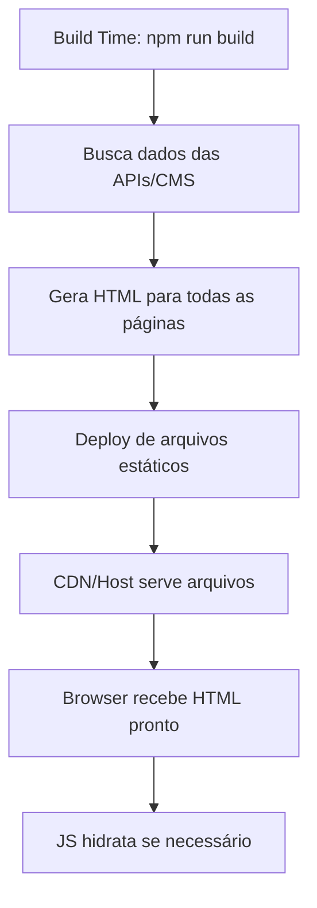
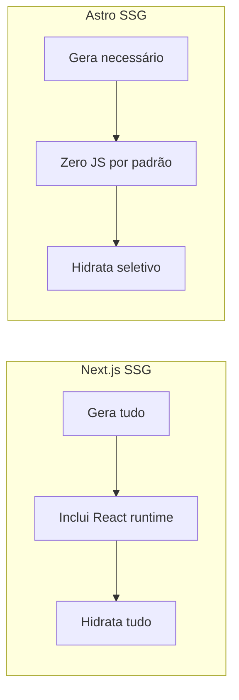

# Static Site Generation (SSG)

## O que é SSG

SSG é quando o HTML é gerado em tempo de build, antes mesmo do deploy. Todas as páginas são pré-renderizadas e servidas como arquivos estáticos.

**Vantagens**: Performance máxima (arquivos estáticos), SEO excelente, hosting barato, segurança alta (sem servidor dinâmico).

### Como funciona



---

## Next.js SSG

1. **Build time**: Comando `npm run build` executado

2. **Fetch de dados**: Next.js busca dados durante o build

   ```javascript
   export async function getStaticProps() {
     const produtos = await fetch("http://api.loja.com/produtos");
     return { props: { produtos } };
   }
   ```

3. **Geração de páginas**: Next.js renderiza todas as páginas

   ```javascript
   export async function getStaticPaths() {
     const produtos = await fetch("http://api.loja.com/produtos");
     const paths = produtos.map((produto) => ({ params: { id: produto.id } }));
     return { paths, fallback: false };
   }
   ```

4. **HTML estático gerado**: Arquivos HTML criados em `/out`

   ```html
   <!DOCTYPE html>
   <html>
     <body>
       <h1>Produtos</h1>
       <ul>
         <li>iPhone</li>
         <li>Samsung</li>
       </ul>
     </body>
   </html>
   ```

5. **Deploy**: Arquivos estáticos enviados para CDN/host

6. **Hidratação**: React conecta interatividade no client-side

---

## Astro SSG

1. **Build time**: Comando `npm run build` executado

2. **Processamento**: Astro processa todos os arquivos `.astro`

   ```astro
   ---
   // Fetch em build-time
   const posts = await fetch("http://cms.blog.com/posts").then(r => r.json());
   ---
   ```

3. **Geração otimizada**: HTML mínimo, CSS inline, JS seletivo

   ```astro
   <!-- Apenas HTML/CSS por padrão -->
   <article>
     <h1>{post.title}</h1>
     <p>{post.content}</p>
   </article>
   ```

4. **HTML otimizado gerado**: Arquivos ultra-leves em `/dist`

   ```html
   <!DOCTYPE html>
   <html>
     <body>
       <h1>Blog</h1>
       <article>Post 1</article>
       <!-- Zero JavaScript por padrão -->
     </body>
   </html>
   ```

5. **Deploy**: Arquivos estáticos otimizados para CDN

6. **Hidratação seletiva**: JS apenas para componentes marcados

---

## Diferença Principal



### Estratégias diferentes

- **Next.js**: Gera páginas estáticas + inclui React runtime para hidratação
- **Astro**: Gera HTML puro + JS apenas onde explicitamente solicitado

### Performance

- **Next.js**: Arquivos maiores (React included), hidratação automática
- **Astro**: Arquivos menores, JavaScript opcional

## Casos de Uso para SSG

### Quando usar SSG

- **Blogs**: Conteúdo que não muda frequentemente
- **Documentação**: Páginas estáticas com navegação
- **Landing pages**: Marketing com performance máxima
- **Portfólios**: Sites pessoais e showcases
- **Sites corporativos**: Informações institucionais
- **E-commerce pequeno**: Catálogo com poucas mudanças

### Quando NÃO usar SSG

- **Dados em tempo real**: Dashboards, feeds ao vivo
- **Conteúdo personalizado**: Por usuário logado
- **Apps interativas**: Muita lógica client-side
- **Conteúdo frequente**: Atualizações constantes

### Framework por caso de uso

| Caso de Uso      | Next.js     | Astro       | Justificativa                                    |
| ---------------- | ----------- | ----------- | ------------------------------------------------ |
| Blog             | ✅ Bom      | ⚡ Ideal    | Astro otimizado para conteúdo                    |
| Documentação     | ✅ Bom      | ⚡ Ideal    | Astro: MDX nativo, performance superior          |
| Landing page     | ✅ Bom      | ⚡ Ideal    | Astro: Lighthouse 100, carregamento instantâneo |
| E-commerce       | ✅ Ideal    | ⚡ Bom      | Next.js: Melhor para funcionalidades complexas  |
| Portfólio        | ✅ Bom      | ⚡ Ideal    | Astro: Performance + facilidade de conteúdo     |
| App complexa     | ✅ Limitado | ❌ Não usar | SSG inadequado para apps interativas             |

## Limitações do SSG

### Problemas comuns

- **Rebuild necessário**: Mudanças requerem novo deploy
- **Dados desatualizados**: Informação pode ficar obsoleta
- **Build time longo**: Sites grandes demoram para gerar
- **Dados dinâmicos**: Impossível para conteúdo em tempo real

### Soluções

- **ISR (Next.js)**: Regeneração incremental sob demanda
- **Webhooks**: Rebuild automático quando CMS muda
- **Hybrid**: Misturar SSG + client-side para dados dinâmicos
- **CDN edge**: Cache inteligente com invalidação
